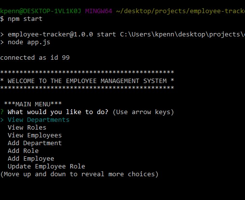

# Employee Tracker

## Description
This is a CLI Employee Management System. When the app is run it connects to a SQL database which has tables for Departments, Roles and Employees. 

You are presented with main menu that allows you to:

* View Departments
* View Roles
* View Employees
* Add a new department
* Add a new role 
* Add a new employee
* Update an employee to a new role

## Table of Contents
* [Installation](#Installation)
* [Usage](#Usage)
* [Technologies](#Technologies)
* [Preview](#Preview)

## Installation
Use `npm i` to install the needed dependencies after copying the repository. 

## Usage
App can be run from the command line using `npm start`

## Technologies
This application was made using

 
with the inquirer, mysql2, dotenv and console.table npm packages 

## Preview
### Screenshots

### Demo Video
https://drive.google.com/file/d/1oJnS5wfqgmSdK4FIvosCrDnV15dXMzKX/view